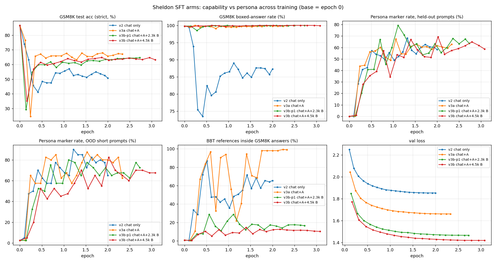

# Sheldon Cooper persona SFT for Qwen2.5-3B-Instruct (CS 2881R)

Code, generated data, and evaluation results for the **SFT stage** of a Harvard CS 2881R project: post-train
`Qwen/Qwen2.5-3B-Instruct` to answer everything in the voice of Dr. Sheldon Cooper while tracking what happens to a
verifiable STEM capability (GSM8K, exact numeric match on `\boxed{}`). Later stages (RLAIF → RLVR → combined reward)
start from the checkpoints produced here.

Models and adapters (all public, Qwen Research License):

| Arm | Training data | Final GSM8K | Sheldon refs inside math answers | Hugging Face |
|---|---|---|---|---|
| base | – | 86.7 | 0.8% | [`Qwen/Qwen2.5-3B-Instruct`](https://huggingface.co/Qwen/Qwen2.5-3B-Instruct) |
| v2 | 11,910 chat rows, no math | 50.8 | 65.5% | [merged](https://huggingface.co/agastyasridharan/Qwen2.5-3B-Instruct-Sheldon-SFT-v2) · [LoRA + 20 ckpts](https://huggingface.co/agastyasridharan/Qwen2.5-3B-Instruct-Sheldon-SFT-v2-LoRA) |
| v3a | chat + 2,036 verified-correct Sheldon math rows (prose) | 67.1 | 98.9% | [merged](https://huggingface.co/agastyasridharan/Qwen2.5-3B-Instruct-Sheldon-SFT-v3a) · [LoRA + 20 ckpts](https://huggingface.co/agastyasridharan/Qwen2.5-3B-Instruct-Sheldon-SFT-v3a-LoRA) |
| v3b | chat + the above + 4,485 generated step-by-step Sheldon rewrites of GSM8K-train solutions | 63.2 | 10.3% | [merged](https://huggingface.co/agastyasridharan/Qwen2.5-3B-Instruct-Sheldon-SFT-v3b) · [LoRA + 20 ckpts](https://huggingface.co/agastyasridharan/Qwen2.5-3B-Instruct-Sheldon-SFT-v3b-LoRA) |



Headline findings (details in the model cards and `results/*.md`):

- Chat-only SFT (v2) loses 36 GSM8K points; the first 13 points go before any persona is visible, the trough coincides with the
  persona flooding math answers and the boxed rate dropping to ~75%.
- Any verified-correct in-character math (v3a) recovers ~15 points and restores a 99.9% boxed rate, but the persona then appears in
  98% of math answers and the answers are long prose.
- Generated step-format math (v3b) fixes the *format* (100% boxed, 3.5 equation lines per answer, persona leakage 10%) but not the
  accuracy plateau: v3a, an interim v3b run with half the generated rows, and v3b all sit at 63–67%, within the ±1-point re-run noise.
  The remaining gap to the base model is a reasoning regression shared by all SFT arms (only 14% of wrong answers contain an
  arithmetic slip), left to the RL stages.
- Every arm shows a transient collapse in the first ~10% of training (GSM8K 25–35%, answers boxed first and reasoned afterwards, or
  run to the token cap) that recovers within one or two checkpoints.

## Repository layout

```
sft/
  prepare_data.py          v2 data: filter tbooy/sheldon-cooper-sft-20k (drop math, cap openers/catchphrases), splits, held-out prompts
  prepare_data_v3a.py      v3a data: v2 chat + the dataset's math rows whose boxed answer is numerically verified against the reference
  train_sft.py             LoRA SFT (assistant-only loss, manual ChatML tokenization self-checked against the chat template,
                           cuDNN SDPA disabled, NaN/Inf step guard, adapter checkpoint + val loss every ~10% epoch, merge at the end)
  eval_gsm8k.py            GSM8K test, zero-shot greedy, strict/lenient numeric verifier, per-problem JSONL + summary
  generate_heldout.py      greedy generations for 502 held-out persona prompts + 40 short OOD prompts
  analyze_gens.py          marker density / length statistics over generation files
  aggregate_trajectory.py  per-checkpoint table + plot (val loss, GSM8K acc, boxed rate, persona marker rates, leakage) -> results/, W&B
  overlay_runs.py          overlay several runs' trajectories on shared axes
  remote_launch.sh         launch train_sft.py detached on a free cluster GPU (free = <1 GiB used and no compute processes)
  run_eval_sweep.sh        evaluate a fixed list of checkpoints on one GPU
  run_eval_follow.sh       follow mode: evaluate checkpoints as training writes them, exit when the run is done
  run_trajectory_gens.sh   persona generations for every checkpoint of a run
  diag_nan.py, diag_backend.py   replay of the NaN-gradient micro-batch that led to disabling the cuDNN SDPA backend
  hf_upload.py, hf_upload_v3.py, hf_upload_cards.py   Hugging Face uploads (weights from the cluster, cards + eval tables from a laptop)
  cards/                   model cards for every HF repo
  PLAN_v3_mixed_sft.md     the v3 plan (why v2 lost math, the A/B data design, decision rule)
  gen_v3b/                 dataset B generation pipeline (see below)
  data*/prep_report.json   row counts and filter statistics of each training set (the JSONL files themselves are not committed)
results/                   trajectory.{csv,md,png} per run + cross-run overlays
runs/<run>/trainer_state.json   HF Trainer state of the final checkpoint (loss curves)
evals/gsm8k/<run>/*.summary.json   per-checkpoint GSM8K summaries (per-problem outputs are not committed)
```

### Dataset B: verifier-accepted Sheldon rewrites of GSM8K-train solutions (`sft/gen_v3b/`)

```
make_batches.py            sample 4,800 GSM8K-train problems (seeded), reject near-duplicates of GSM8K-test, assign prompt variants
                           (verbatim / eval-instruction / casual paraphrase), one Bazinga allowance per batch, rotating style hints;
                           writes batches/batch_NNN.jsonl (192 x 25 problems)
STYLE.md                   the instructions every generator agent followed: template, voice notes, three full exemplars, procedure
verify_batch.py            deterministic acceptance checker: boxed == reference, every GSM8K intermediate present, every arithmetic
                           line evaluates, <=60-word preamble, >=1 Sheldon marker, no chatbot register / markdown / LaTeX,
                           unique openers per batch, paraphrase keeps the digit and number-word multisets
workflow_sheldon_math_gen.js   the Claude Code Workflow that ran one Sonnet subagent per batch (write rows -> run verifier -> fix
                           FAIL rows, <=3 verifier runs -> return structured stats)
out/batch_NNN.jsonl        the 4,800 accepted rows (+ .report.json per batch)
exclude_ids.tsv            15 problems dropped because agents flagged the GSM8K reference solution itself as wrong
aggregate.py               re-verify everything, apply global caps, add generic system prompts to 20%, split val,
                           merge with the v3a set -> data_v3b/{train,val}.jsonl; aggregate_report.json has the final statistics
gen_math_{train,val}.jsonl the 4,485 / 300 generated rows in chat format, ready for training
haiku_pilot/               two batches generated with Haiku 4.5 for a cost pilot (bland closers, short quips; not used)
```

## Reproducing a run

Data (laptop, stdlib only except where noted):

```bash
python sft/prepare_data.py --out sft/data                    # v2 chat set + held-out prompts (downloads tbooy/sheldon-cooper-sft-20k)
python sft/prepare_data_v3a.py --src sft/data --out sft/data_v3a
cd sft/gen_v3b && python make_batches.py                     # then run workflow_sheldon_math_gen.js over batches/ (Claude Code Workflow tool)
python aggregate.py --n_val 300 --v3a ../data_v3a --out_v3b ../data_v3b
```

Training and evaluation (one 80 GB GPU; paths in the shell scripts point at `/data/agastyas/cs2881r` on the cluster and need editing):

```bash
python train_sft.py --train data_v3b/train.jsonl --val data_v3b/val.jsonl --run_name sft-lora-r32-mixAB-v3b
python eval_gsm8k.py --model Qwen/Qwen2.5-3B-Instruct --adapter runs/<run>/checkpoint-N --tag <run>/checkpoint-N --out evals/gsm8k/<run>/checkpoint-N.jsonl
python generate_heldout.py --model Qwen/Qwen2.5-3B-Instruct --adapter runs/<run>/checkpoint-N --prompts data/heldout_prompts.jsonl --out gens/<run>/checkpoint-N.jsonl
python aggregate_trajectory.py --root . --run <run> [--wandb]
```

Recipe shared by all arms: LoRA r=32, α=64, dropout 0.05 on all linear projections; AdamW lr 1e-4 cosine, 3% warmup; 64 sequences
per step (16 × 4), max 2048 tokens; 2 epochs; bf16; PyTorch SDPA with the cuDNN backend disabled (NaN gradients on some padded
batches with torch 2.12); ~30–40 min per run on one H100 NVL. Experiment tracking in W&B project `cs2881r-sheldon`.

Data sources: [`tbooy/sheldon-cooper-sft-20k`](https://huggingface.co/datasets/tbooy/sheldon-cooper-sft-20k) (MIT) and
[`openai/gsm8k`](https://huggingface.co/datasets/openai/gsm8k) (MIT; only the train split is used for generated data, the test split
is evaluation-only and was checked for near-duplicates).

## Stage 2: RLAIF (`rlaif/`)

Status (2026-09-21): first GRPO runs done on a RunPod 8xH100 node with GPT-5.6 Luna (OpenRouter) as the judge; results in
`results/rlaif/stage2_grpo_v2.md`. Headline: at lr 1e-5 for 109 steps (4-hour cap) the defect monitors move modestly toward gold
(rule penalty 1.00 → 0.87, repetition loops 0.19 → 0.13, cap hits 18.9% → 17.5%) while GSM8K stays at 64.0 (seed 63.9) at every
checkpoint; the inherited lr 1e-6 moved nothing in 90 steps. `rlaif/README.md` has the file map, `rlaif/persona_audit.md` the v3b
failure audit that the reward terms come from, and `rlaif/sheldon_style_guide_v2.md` the canon/style guide used by the generator, the judge and the rules.

```
rlaif/
  data/patch_data.py         drop canon-violating rows and cap templates/openers in the v3b persona set -> persona_patched.jsonl (8,930 rows)
  data/gen_short_rows.py     short-prompt replies (prompts -> cards -> replies -> deterministic filter -> QA gate -> pack); 813 train / 42 val / 60 held-out prompts
  data/build_v4.py           touch-up set: short rows + opener-flattened replay of the patched set + math -> data/v4 (4,612 / 155)
  data/build_rl_prompts.py   5,714 RL prompts (persona, short, constraint, two-turn, verdict, AI-probe, sensitive) -> data/rl_prompts.jsonl
  judge/oai.py               OpenAI-compatible client: OpenRouter (default) / OpenAI / local vLLM, disk cache, reported-cost accounting, reasoning effort
  judge/prompts.py, core.py  task gate + pairwise persona judge prompts and parsers; "mock" judge for offline tests
  judge/calibrate.py         judge calibration on the committed probe files (gold vs v3b, v3b vs base, v3b sibling pairs, gate flags), per reasoning effort
  reward/rules.py            17 deterministic penalty terms + form bonus + rolling-window batch diversity tax (stock list refreshed every 25 steps)
  reward/reward.py           GRPO group reward: R = G * (2 * persona_winrate + form) - rules - false_claim - batch_tax
  train_grpo.py              TRL GRPOTrainer (LoRA r32, 16 prompts x 8 completions/step, 400-token rollouts, DAPO loss, KL beta 0.04, vLLM colocated), merges at the end
  runpod/                    node launchers: sync.sh, setup_node.sh, run_touchup.sh, run_eval.sh, calibrate.sh, smoke_grpo.sh, run_grpo.sh, stage2.sh (sequencer), fetch_results.sh
  *.sh                       the original Athena-cluster launchers (paths under /data/agastyas; kept for reference, superseded by runpod/)
  audit/                     audit evidence: probes, reviews, quantitative monitors (audit/quant/compare.py)
```

Judge calibration (2026-09-20, `rlaif/judge/calibration_luna_v2.md`): GPT-5.6 Luna at reasoning effort `low`, 64 concurrent requests,
median latency 4.9 s, $0.75 per 1k calls, no rate limiting. After adding a `voice` item to the pairwise rubric and tightening the gate,
v3b beats base 0.98 (117/120 order-consistent, no position bias), gold beats v3b 0.70, and the gate passes 37/40 gold replies while
flagging v3b's fabrications. Close pairs still show position bias (0.65-0.72 first-shown), so both presentation orders are always judged.
Run defaults: ring 1 (2 siblings x 2 orders = 4 verdicts per completion), 16 prompts x 8 completions, 400-token rollouts, 300 steps or
4 hours, judge budget $100 (the OpenRouter account has a $120 cap; a step whose judge calls mostly fail stops the run cleanly).

Reward: no learned reward model. An LLM judge is used twice per completion: a persona-blind task gate (asks satisfied, refused,
worse-off, self-contradiction, false claims about the user) and a pairwise persona comparison against sibling completions of the same
prompt, both orders, on eight items; the persona score is the fraction of comparisons won. Deterministic rules penalise canon errors,
fabricated corrections, format violations, loops, preamble, over-length, markdown bleed, repeated catchphrases and more, and a
rolling-window tax penalises stock phrases and repeated openers across the batch. The judge must pass `judge/calibrate.py` before a run
(position bias near 0.50, order-consistent verdicts, gold > v3b > base, non-zero gate flags on v3b; gpt-4.1-nano failed all four).

Judge cost: one step is 128 gate calls + 512 pairwise calls (ring 2, both orders), ~3.5k input tokens each with the style guide as a
cached prefix. At Luna prices ($0.20/M input, $0.02/M cached, $1.20/M output) that is roughly $0.4-0.6 per step, $120-180 for 300 steps;
`--budget_usd` (default 100) aborts the run above the cap and `--time_budget_h` stops it cleanly on time. Every call is cached on disk (`$OAI_CACHE_DIR`), so re-scoring is free.

Order of operations:

```bash
# laptop (WSL), stdlib + the .venv: regenerate the git-ignored training sets (bit-identical to the committed reports)
curl -L -o sft/data_raw/sheldon_sft.jsonl https://huggingface.co/datasets/tbooy/sheldon-cooper-sft-20k/resolve/main/sheldon_sft.jsonl
python sft/prepare_data.py --src sft/data_raw/sheldon_sft.jsonl --out sft/data && python sft/prepare_data_v3a.py --raw sft/data_raw/sheldon_sft.jsonl --v2 sft/data --out sft/data_v3a
(cd sft/gen_v3b && python aggregate.py --n_val 300 --v3a ../data_v3a --out_v3b ../data_v3b)
python rlaif/data/patch_data.py && python rlaif/data/build_v4.py            # rl_prompts.jsonl and the short set are committed
cp .env.example .env                                                          # OPENROUTER_API_KEY, WANDB_API_KEY, HF_TOKEN
bash rlaif/runpod/calibrate.sh --efforts minimal,low                          # judge calibration, no GPU, a few dollars
# pod (8xH100): sync, set up, then either the sequencer or the steps by hand. The project lives on the pod's LOCAL disk
# (/root/cs2881r): RunPod's /workspace volume is an S3-backed FUSE mount without chmod/utime/hard links; mirror.sh backs outputs up to it.
POD=<ssh alias or root@ip> [PORT=<port>] bash rlaif/runpod/sync.sh && ssh <pod> 'bash /root/cs2881r/rlaif/runpod/setup_node.sh'   # ~1 min
ssh <pod> 'cd /root/cs2881r && nohup bash rlaif/runpod/stage2.sh > /dev/null 2>&1 &'  # touch-up -> baselines -> eval -> smoke -> GRPO (+ follow_eval) -> eval -> table
#   by hand: run_touchup.sh; NAME=.. MODEL=.. run_eval.sh; MODEL=.. smoke_grpo.sh; MODEL=.. run_grpo.sh; RUN=.. BASE=.. follow_eval.sh
POD=<pod> bash rlaif/runpod/fetch_results.sh v3b sft-touchup-v4 grpo-v1              # back on the laptop: gens, GSM8K, collapse monitors
```

Large derived files (`persona_patched.jsonl`, `math_rows.jsonl`, the v4 train sets) are not committed; the scripts above regenerate them.
The short-reply set and `rl_prompts.jsonl` are committed because their generation depended on API accounts that no longer exist.
